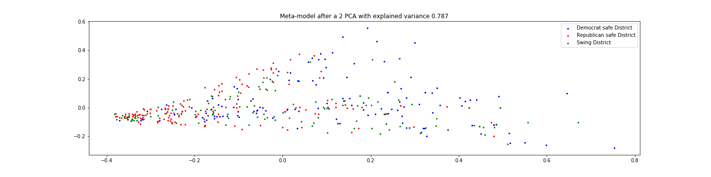

# Approach, models and assumption.

## Modelling assumptions and prediction problem
- Let's recall that the datatset, after the full cleaning process consits of (socio-eonomic and demographic) **SCD indicators** for each pair (district, year), with the years ranging from 2010 to 2018 (predictors). The label is a 3 class vectors representing whether the elected candidate is "republican", "democrat" or "other".
- The **training set** consists of the 2010-2016 timeline whereas the 2018 data is held as the **test set**. 
- In the first place we decide to neglect the "other" candidate class which is factually an edge case (38 cases over the entire dataset).
- Furthermore, we formulate the hypothesis that providing a model with the history of elected candidates might improve a model predictive power (indeed, some districts are historically republican and not prone to any change, and reversely). Therefore, we explore two scenarios: one including variables representing historical results (explicitly, moving averages of the past elected candidates) and a 'control' scenario without those variables. 
- We present the results of different well know learning algorithms, namely:
* Logistic Regression (with l1, l2 regularization terms)
* Decsion trees
* Random Forest
* Gradient boosting 
The exact results are presented in the next section, for both scenarios. In short, we prove that some of those, together with our assumptions yield accurate predictions. 

## Going one step further: understanding what matters
We show that statistically predicting the elections is promising with the different models proposed (even if it is relatively hard to say whether the results are concretely applicable. Delving into the analysis of the error would be one of the key future work) (cf next section and accompanying notebook). 

With this statement in mind, we note the following:
* **Accurate predictions** does not provide answers
* **Without understanding** what are the features that actually lead a model to accurate predictions, these results might be **superficial** and such a model has no value in practice if it **can not be interpreted by a human practicioner** (not deployable). In this high-stake context, one would rather **understand the elements** that urge a model to lean towards one class and that characterizes the voters. 

Therefore, the following analysis focuses on **interpreting** the features that influence the vote
* First, we hypothesize that some type of 'political noise' exist within the dataset. We support this asusmption with an a

* We perform dimensionality reduction (PCA, t-SNE) to get a better idea of some potential latent clusters of the data. _Below, 2-d PCA and t-SNE plots_
 

- Extremeley close points. Non-identifibality
- 'Political noise' - variance over time negligeable -> Picture Noise. + HIsti+STD per district. 
Less noisiness. 

- Urges us to put into practice those
- Dimensionality reduction==> PCA and t-SNE. 
- Logitsi regression woth Lasso--> *Bootsrap, smot to takcle the pb of feat. importance. 

### Temporal stability of socio-economic predictors

The variability of the socio-economic predictors over years does not affect much the global population in a district. The only predictors which changes significantly only concern a tiny proportion of the whole population.

To quantify this statement, let's study the variance of each of these predictors. All of these predictors represents proportions of the global population.

Let's calculate the variance of the relevant predictors in each district over the last 5 elections.

The standard deviation represents the order of magnitude of the percentage of the whole population affected by the changes of these predictors.

Almost all standard deviations are lower than 2%. It means that the variability of these predictors affect less than 2% of the whole population, hence they are neglictible. It makes sense with the fact, that during 8 years, the socio-economic factor of a population doesn't really change.

Therefore, we can use the average values of these predictors to understand if they can explain wether a district is a safe stronghold or rather a swing district.

The figure below shows how noisy our data is : political noise. We see how close Democrat and Republican elected districts are with our PCA which can not accurately create a descision function

## 1 -  

## 2- 

Our baseline model is a logistic regression that predicts the results of each district. This model takes in input some social-economic predictors with general political information. We have trained this model in the results of the House of States elections from 2010 to 2016 and we tested this model on the 2018 elections. 

2) description of our implementations beyond baseline with design choices

    a) Part Théo + Will
    


