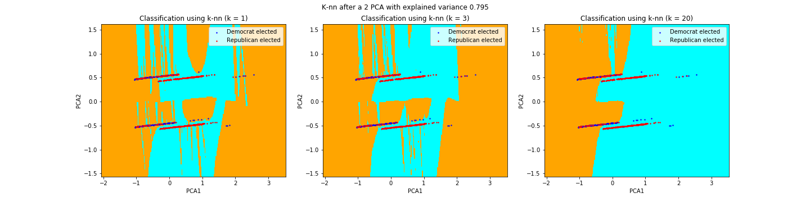
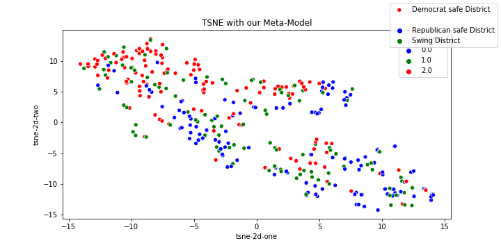

# Approach, models and assumption

## Modelling assumptions and prediction problem
- Let's recall that the datatset, after the full cleaning process consits of (socio-eonomic and demographic) **SCD indicators** for each pair (district, year), with the years ranging from 2010 to 2018 (predictors). The label is a 3 class vectors representing whether the elected candidate is "Republican", "Democrat" or "other".
- The **training set** consists of the 2010-2016 timeline whereas the 2018 data is held as the **test set**. 
- In the first place we decide to neglect the "other" candidate class which is factually an edge case (38 cases over the entire dataset).
- Furthermore, we formulate the hypothesis that providing a model with the history of elected candidates might improve a model predictive power (indeed, some districts are historically republican and not prone to any change, and reversely). Therefore, we explore two scenarios: one including variables representing historical results (explicitly, moving averages of the past elected candidates) and a 'control' scenario without those variables. 
- We present the results of different well know learning algorithms, namely:
* Logistic Regression (with l1, l2 regularization terms)
* Decsion trees
* Random Forest
* Gradient boosting 
The exact results are presented in the next section, for both scenarios. In short, we prove that some of those, together with our assumptions yield accurate predictions. 

## Going one step further: understanding what matters
We show that statistically predicting the elections is promising with the different models proposed (even if it is relatively hard to say whether the results are concretely applicable. Delving into the analysis of the error would be one of the key future work) (cf next section and accompanying notebook). 

With this statement in mind, we note the following:
* **Accurate predictions** does not provide answers
* **Without understanding** what are the features that actually lead a model to accurate predictions, these results might be **superficial** and such a model has no value in practice if it **can not be interpreted by a human practicioner** (not deployable). In this high-stake context, one would rather **understand the elements** that urge a model to lean towards one class and that characterizes the voters. 

Therefore, the following analysis focuses on **interpreting** the features that influence the vote
* First, we make the hypothesis that some type of 'political noise' exist within the dataset. We support this assumption with a **visual analysis**: performing **dimensionality reduction** and fitting a knn classifier ont he reduced data. The points are extremeley close and the model probably not identifiable. _Below, the **decision boundaries (without clear pattern nor sense)**_

* The **variability of the SCD predictors over years is low within a district**. The only predictors which changes significantly only concern a tiny proportion of the whole population. _Below, the standard deviation of the predictors within a fixed distric over the years (considering time-series). A point represents a pair (district, predictor) 
* Therefore, we **aggregate the data over the years**, reducing the temporal noise that exists and **improving the stability** of the features.
* Furthermore, to pursue our goal, we decide to consider the **entire timeframe** in our dataset. The training set now consists of a randomly selected portion of the entire dataset (90%) (years ranging from 2010-2018) and the rest is held for the test set. 
* With these changes, we perform **dimensionality reduction** (PCA, t-SNE) to get a better idea of some potential **latent clusters** of the data and observe that the **noise seems lowered down** by our assumption. _Below, 2-d PCA and t-SNE plots_
 
* We ultimately use a logisitc regression model with $$l1 penalty$$ for feature selection and interpreting the weights. This is the main goal of the analysis: gaining insight into the features that impact a model's predictions. Our analysis is supported by a bootsrap methodology and AB testing for statistical significance.

Please refer to our explanatory notebook and next section for more information.

[Next page:](https://tguens.github.io/understand-predict-winner.github.io/resultsa.html)

[Previous page:](https://tguens.github.io/understand-predict-winner.github.io/relatedwork.html)

[Back to main](https://tguens.github.io/understand-predict-winner.github.io/)


