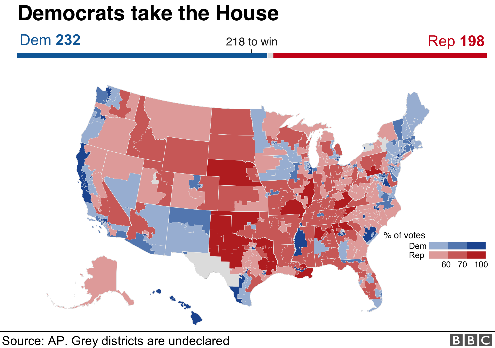
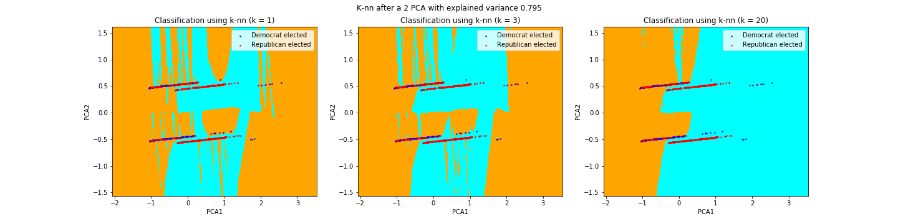

# Introduction
_2018 Elections' results_:

## Background
The 2018 midterm elections were held on November, 6th, 2018. 435 seats were contested. Each seat represents a district which is a part of a single State and includes around 700,000 people. The boundaries of a district is refined every ten years to ensure equal number of people in every districts.

President Donald Trump was the incumbent Republican President. The Republican lost the elections (199 seat for the Republicans and 235 for the Democrats, one Representative identified himself as independant). A loss at such extent for the Party holding the Presidency during the midterms has not been seen since 1990 [6](https://tguens.github.io/understand-predict-winner.github.io/references.html).

The midterm elections are crucial for the government. The outcomes will dictate the second part of the incumbent President term. If the latter won a majority in both houses of the Congress, it ensures him free hand to conduct its politics.

Predicting the election is essential for campaign and political advisors. Having some insights about the most impactful predictors can help guiding the candidates into finding the right strategy to gain the support of more electors. Predicting and studying past elections can provide valuable information. **But more importantly, understanding what are the factors that govern the vote goes one step further in this direction.**

## Why is predicting a challenge ?
Predicting the elections' results is strongly related to understanding human behavior: why would one find a candidate or party appealing? Even if we have access to very detailed socio-economic variables or precise polls, there are abstract or latent variables that will lead the trend. Elements such as _popularity_, _mood_, or _influence of media_ are difficult to quantify, to detect or even define. Hence, we can cast doubt on predictions due to unknown parameters which can significantly influence the outcome of the vote.

_Presenting the noise within the data:_

### Problematic
**What are the economic, social or demographic factors that are the most influential to predict the popular vote? Are those actually accurate predictors?**
Besides presenting some model with accurate predictions, we make assumptions in order to make the analysis much more sound and that leads to a dataset with reduced variability and notably enables us to perform feature selection. Furthermore, we also that a prior belief that the American political stand is shaped by key events (political, economic,..). Therefore, we develop a Bayesian model on polls' data that yields promising resulst: political popularity is shaped by 'outside events'.

### Description of data
The following data was gathered, for visualization, exploration and model fitting. 

1. **House of States Results**

Harvard’s Dataverse and FEC report [2,3](https://tguens.github.io/understand-predict-winner.github.io/references.html)  were combined in order to obtain the different percentages of votes assigned to each candidate for a given district. To simplify those results, the team made the assumption that the results of a vote could be limited to classes: ‘main republican candidate’, ‘main democrat candidate’ and ‘other’. This approximation is far from being crude in practice and is experimentally verified. These results are considered as the labels. Over a second phase, the 'other category was removed' (please refer to the accompanying notebook for further details).

2. **Origin and ethinc groups**

These date were extracted from observations of the US Census Bureau (Population division) [11](https://tguens.github.io/understand-predict-winner.github.io/references.html). It contains the total numbers of male and female in different ethnical group at the counties levels from April 1, 2010 to July 1, 2017. We sum these numbers, to obtain the proportions of these groups per districts. We present the entire data cleaning approach [here](https://github.com/tguens/cs109-project).

3. **Poverty and unemployment**

Similarly, poverty, occupation and income statistics were gathered from the American Community Survey (2017-5 year statistics, table _DP03_).

4. **Polls** 

Polls data are scraped the Huffington Post [10]. Percentages of intended votes (for Democrats, Republican, other parties) and the percentage of undecided voters at the federal level, monthly-from January 2017 and November 2018.

[Next page: Related work](https://tguens.github.io/understand-predict-winner.github.io/relatedwork.html)
