## 5) Project trajectory, results and interpretation

1) Briefly summarize any changes

2) Results
- model performances
- interpretations
- meaning of results
- impact of our work

### Exploratory Data Analysis on socio-economic predictors

Let's present our findings on the link between socio-economic predictors and elections.

The following database shows the statistics about racial data of districts that have not change during the last five elections (remained Democrat or Republican).

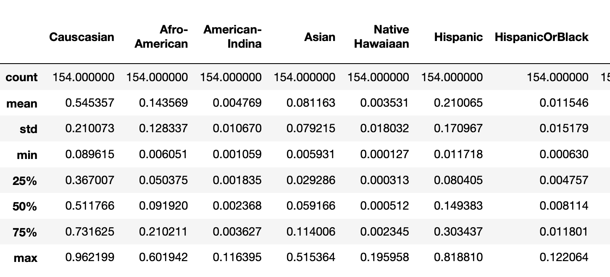

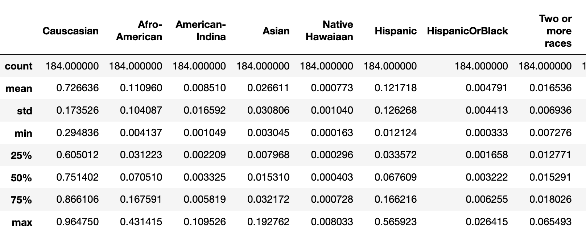

The different statistics shown above seem to show some quite significant differences when it comes to the origins considered. For instance, the percentage of non-hispanic white americans seems higher (higher mean and smaller variance). Visually, let's take a look a look at the different distributions side by side.

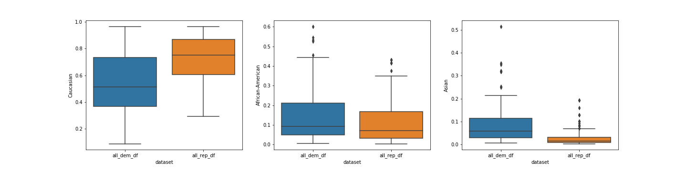

A couple of elements might be worth noting:
- Caucasian: Republican districts have higher means with a distribution much narrower.
- African Amrican: Republican districts' distribution of votes is on the bottom side.
- Asian: Democrat districts seem to have more Asian voters than hispanic.

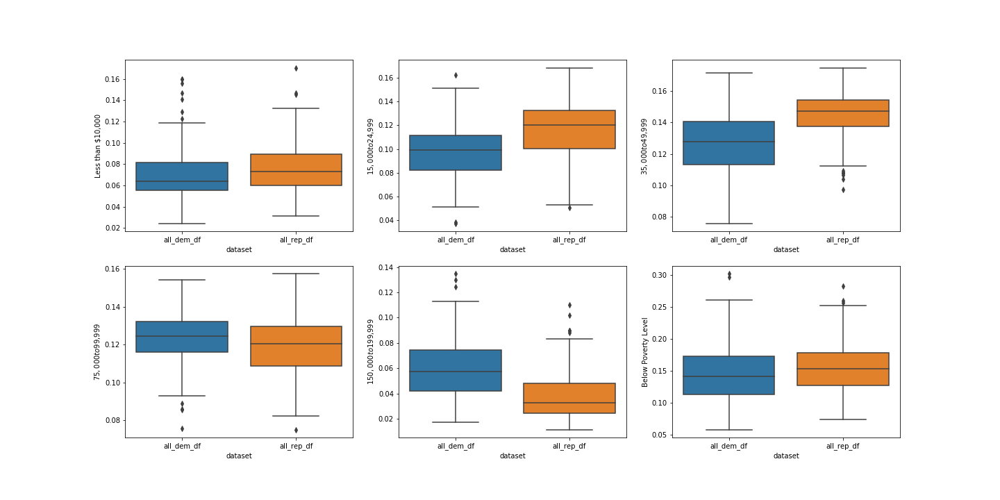

There is an interesting trend that appears in the previous plots. It seems that in the "democrats" districts contain the lowest income population subgroup, as well as the highest income - even though those distircts might not be the same (cf two last plots - highest income and below poverty level).

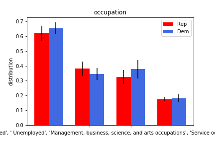

In particular, even though it is an interpretation that is pretty hard to assert, one interesting pattern whcih appears is that in the 'republican districts', when averaged over the different years, the average distribution of unemployed inhabitants seems higher than in democrats' districts. However, in the different plots presented about the income level, the democrats' districts were "more prone" to have people living below the poverty level. One of the interpetation might be that the poorest people might be only a extremely limited part of the unemployed population.

### Predicting popular vote through polls

i) Short EDA

The graph below shows the spread of polls results on percentages of Republican and Democrat votes. We can see that most polls are in favor of the Democrats, but there are lots of variety among the results. Hence, polls show very different possible outcomes. It is also difficult to tell if there is an evolution trend either.

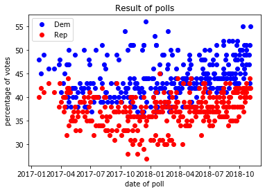

The following boxplot shows the distribution of results given by each source of polls. On this plot, we can see that certain polls tends to give less credit to Democrat votes, but there survey may include more undecided people.

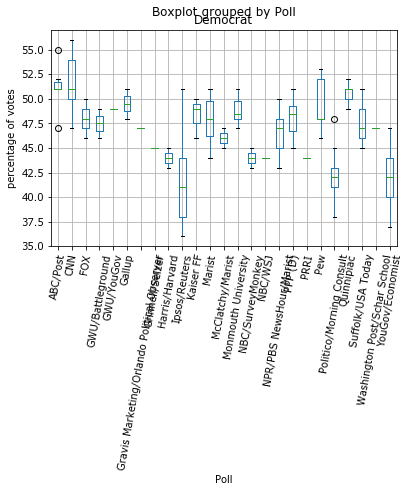

It is worth noting that a significant number of targeted people doesn't know yet for which candidate they will vote. This number of undecided voters can vary a lot among polls (~ 2% to 30%). This number is even high a few days before election day, hence a lot of uncertainty remains.

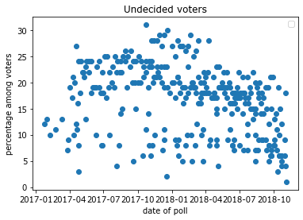

ii) importance of imposing a transition variance
        
If we let the algorithm find by itself the transition variance (variance of the random walk) with MLE, it can be prone to overfitting the observations. We want realistic smooth curve for the national intention of vote, so we need to impose a low transition variance.

Let's have a look of the smoothing curve of Democrat votes for different values of transition variance.

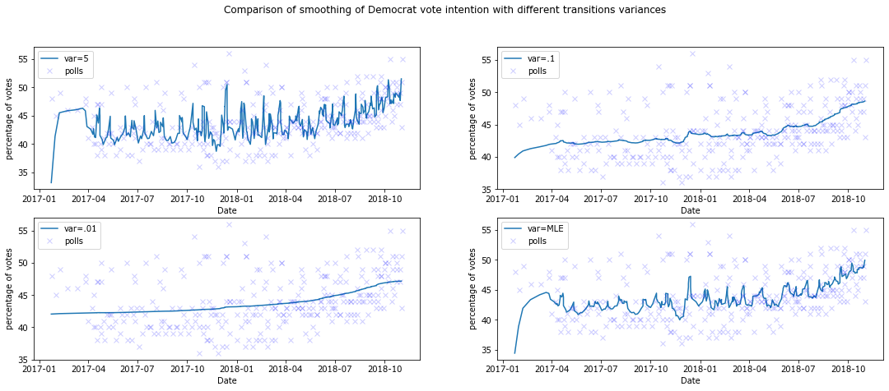

Empirically, a transition variance of 0.1 seems to be a good fit. The MLE estimation is subject to overfitting, as it is too much sensitive to the noisy observations.

iii) Smoothing and confidence intervals
        
As the distributions are gaussians, the 95% confidence interval is given by adding +- 2 standard deviations to the smoothed values.

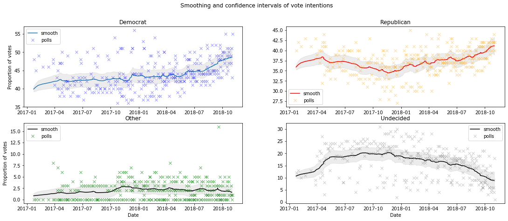

It is very interesting to have the confidence intervals, it can give valuable insights to compare Democrats and Republicans.The undecided estimations are quite high but decreases before election day. 

Because of the lack of observations and the arbitrary choice of the first hidden state, the estimation are less precise at the beginning of 2017.

In the last part we will compare these hidden states estimation to the actual results.

iv) Normalization of results

As we use four different filters, we lost the sum to one. So we need to normalize these estimations to compare them together. Except during the first months that are less precise (c.f. last part), we observe that the sum is very close to 100%.

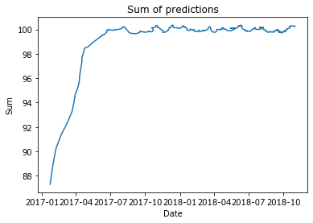
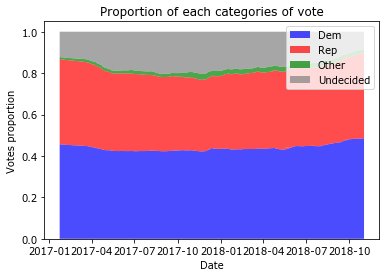

v) Comparison with the election results of November 6 2018

This article from Wikipedia gives the result of the popular vote for the House of State elections on November 6 2018. The Democrats won with an astounding majority (nearly 8% more than the Republican, this result hasn't occured since 1990).

The problem is that even at the end of the election, a significant proportion of undecided voters subsists. We can suppose that this undecided intention of votes will follow the same distribution as the decided votes. Then we can add an undecided margin of errors to our predictions. In this study, we will neglect this source of uncertainty.

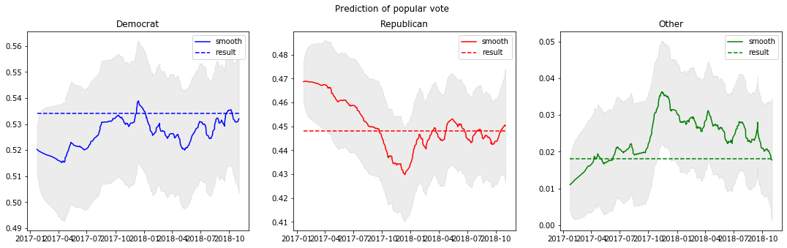

Finally by not taking into account the undecided voters, we obtain some very good predictions for 2018. We can notice that the 95% confidence intervals of Democrat and Republican don't overlap, so the victory of the Democrats was very certain.

vi) Comparison with political events

These smoothing curves can also help to identify evolution shift, for example we can see that Republican intention of votes have been declining. Then people working in analytics can relate these shifts or evolution to real events, and understand the consequences of some events on vote intention. Therefore, this smoothing curve is valuable for people who are looking for election insights.

The following article relates major events that has impacted the 2018 Congress election:  
https://ballotpedia.org/Timeline_of_events_impacting_2018_congressional_elections.

In January 2018, we can notice that a resurgence of vote intentions for the Republican. This period corresponds to the government shutdown, it might be one of the cause of this resurgence.

Let's try to compare the evolutions of vote intentions with some political events extracted from the *Ballot Pedia* article. We restrict the comparison to the last major events that appears before the election from January 2018 to July 2018. 

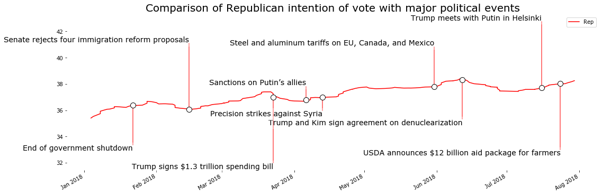

Some of these events could explain some changes of vote intention, but we need to be careful that it can be just a coincidence.
