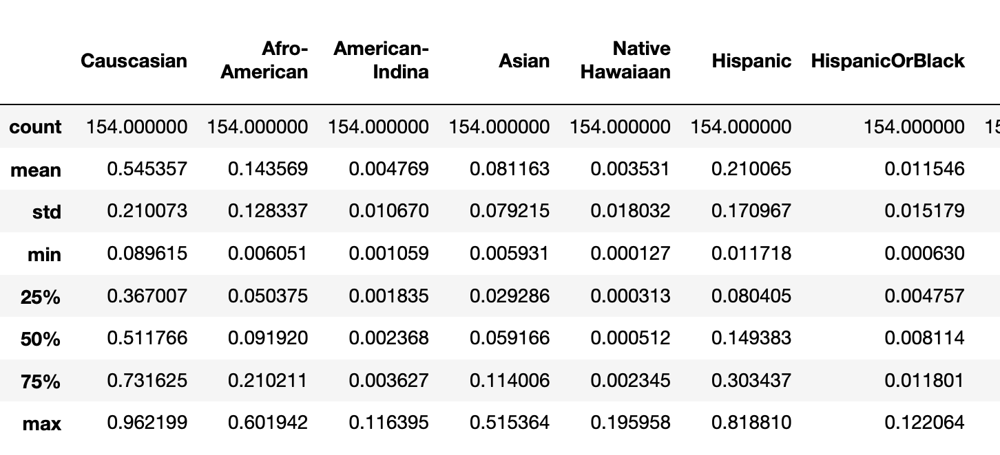
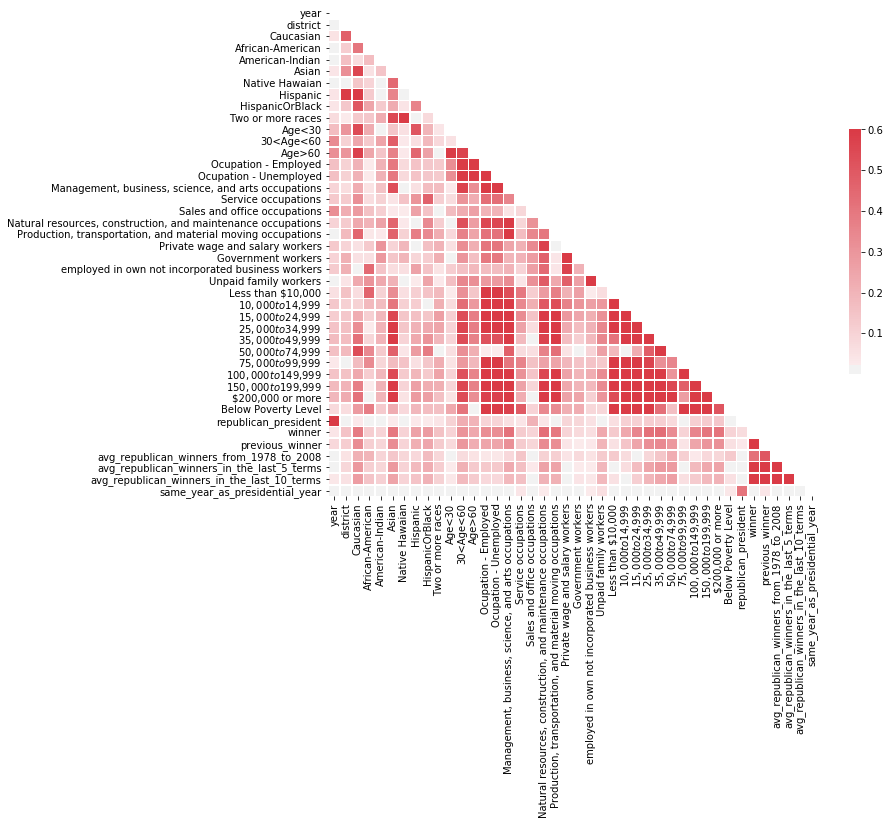

## 5) Project trajectory, results and interpretation

### I) Exploratory Data Analysis on socio-economic predictors

We started by exploring the data that we had, our features to guide us into the right model to use.

#### Race and Election Results

**First, we need to examine the values of our features.** We divided our data in terms of districts that always elected Republican deputies since 2010 or districts that always elected Democrat deputies.

The following database shows the statistics about racial data of districts that have not changed during the last five elections (remained Democrat or remained Republican).

  
   

The different statistics already unveil notable differences vis a vis the demographics of the districts that support Democrats and Republicans. For instance, the percentage of non-hispanic white Americans is higher (higher mean and smaller variance). Visually, let's compare the distribution of different races between Democrat and Republican strongholds.

The next plot compare the distribution of races between Democrat and Republican strongholds:

A couple of elements might be worth noting:
- Caucasian: Republican districts have higher means with a distribution much narrower.
- African American: Republican districts' distribution of votes is on the bottom side.
- Asian: Democrat districts seem to have more Asian voters than Hispanic voters.

#### Income and Election Results

The next plot compare the distribution of income classes between Democrat and Republican strongholds

Here, we note that there is a strong correlation between **Democrat strongholds** and **low income** population subgroups, as well as **very-high income** - even though those districts might not be the same (c.f. two last plots - highest income and below poverty level).

#### Jobs and Election Results

The next plots presents the distribution of classes of jobs among Democrat and Republican stronghold:

A noteworthy pattern is that in the Republican strongholds the average distribution of unemployed inhabitants seems higher than in Democrat stronghold. However, in the different plots presented about the income level, the democrats' districts were "more prone" to have people living below the poverty level. One of the interpetation might be that the poorest people might be only a extremely limited part of the unemployed population.

The matrix below show us the absolute values of the correlation coefficients between our predictors. We have to be careful not to misinterpret the socio-economic predictors as they are proportions in a district.

This matrix justifies that our predictors are correlated. Some correlation makes sense like the proportion of low salaries and of unemployment. Hence we could use a method to select features or to decrease the number of features like Principal Analysis Component.

### II) Model performances

#### A) Baseline model

#### B) Temporal stability of socio-economic predictors

The variability of the socio-economic predictors over years does not affect much the global population in a district. The only predictors which changes significantly only concern a tiny proportion of the whole population.

To quantify this statement, let's study the variance of each of these predictors. All of these predictors represents proportions of the global population.

Let's calculate the variance of the relevant predictors in each district over the last 5 elections.

[im20](pictures/Hist_STD_per_district.png)

The standard deviation represents the order of magnitude of the percentage of the whole population affected by the changes of these predictors.

Almost all standard deviations are lower than 2%. It means that the variability of these predictors affect less than 2% of the whole population, hence they are neglictible. It makes sense with the fact, that during 8 years, the socio-economic factor of a population doesn't really change.

Therefore, we can use the average values of these predictors to understand if they can explain wether a district is a safe stronghold or rather a swing district.

The figure below shows how noisy our data is : political noise. We see how close Democrat and Republican elected districts are with our PCA which can not accurately create a descision function

[im21](pictures/noisiness_proximity_points.png)

[im30](pictures/less_noisiness_with_model.png)
