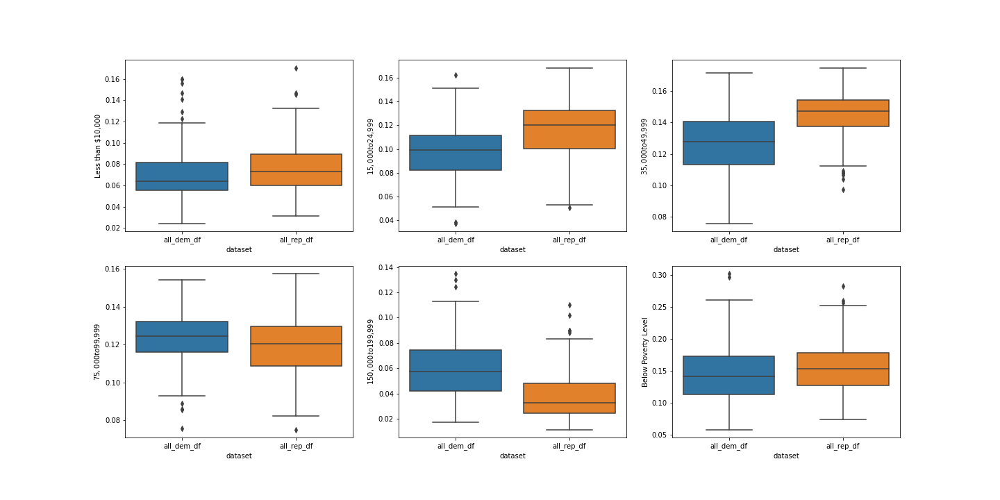

## Project trajectory, results and interpretation

### I) Exploratory Data Analysis on socio-economic predictors

We started by exploring the data that we had, our features to guide us into the right model to use.

#### Race and Election Results

**First, we need to examine the values of our features.** We divided our data in terms of districts that always elected Republican deputies since 2010 or districts that always elected Democrat deputies.

The following database shows the statistics about racial data of districts that have not changed during the last five elections (remained Democrat or remained Republican).

  
   

The different statistics already unveil notable differences vis a vis the demographics of the districts that support Democrats and Republicans. For instance, the percentage of non-hispanic white Americans is higher (higher mean and smaller variance). Visually, let's compare the distribution of different races between Democrat and Republican strongholds.

The next plot compare the distribution of races between Democrat and Republican strongholds:

_Distribution of races between Democrat and Republican strongholds_

A couple of elements might be worth noting:
- Caucasian: Republican districts have higher means with a distribution much narrower.
- African American: Republican districts' distribution of votes is on the bottom side.
- Asian: Democrat districts seem to have more Asian voters than Hispanic voters.

#### Income and Election Results

The next plot compare the distribution of income classes between Democrat and Republican strongholds

_Distribution of Income between Democrat and Republican strongholds_

Here, we note that there is a strong correlation between **Democrat strongholds** and **low income** population subgroups, as well as **very-high income** - even though those districts might not be the same (c.f. two last plots - highest income and below poverty level).

#### Jobs and Election Results

The next plots presents the distribution of classes of jobs among Democrat and Republican stronghold:

_Distribution of Age/Occupation subgroups between Democrat and Republican strongholds_

  
   

A noteworthy pattern is that in the Republican strongholds the average distribution of unemployed inhabitants seems higher than in Democrat stronghold. However, in the different plots presented about the income level, the democrats' districts were "more prone" to have people living below the poverty level. One of the interpetation might be that the poorest people might be only a extremely limited part of the unemployed population.

The matrix below show us the absolute values of the correlation coefficients between our predictors. We have to be careful not to misinterpret the socio-economic predictors as they are proportions in a district.

#### Getting rid of Correlated Features

_Correlation Matrix between features_

As we know, correlation needs to be avoided, it can cause our models to overfit.

This matrix justifies that our predictors are correlated. Some correlation makes sense like the proportion of low salaries and of unemployment. Hence we could use a method to select features or to decrease the number of features like Principal Analysis Component.
We did use this correlation matrix to delete ['Ocupation - Unemployed', '$100,000 to $149,999', '$150,000 to $199,999'] as those 3 features has a correlation with other features that were greater then 0.5

### II) Model performances

#### A) Baseline model
_Results of our Baseline Model in function of whether Past Election results information was used_

  
   

#### B) Meta - Model

As explained in the previous section, one came to the conclusion that because of low variability and un-identifiability due to political noise/volatility, aggregating the dataset at a district level was the right path to embark on

We therefore have a totally new dataset,freed from predicting election results by now used to predict the propensity of a district to be either a republican bastion,a democrat bastion or a swing district.
We now have three categories :
- 'Republican Safe District' : 2
- 'Swing District': 1
- 'Democrat Safe District': 0

**It's with the combination of this new dataset and a multi-class Logistic regression that one might conclude on the relative importance of social, economic and demographic factors in the House of Representative election results.**

To tackle class imbalance between the Safe districts and the Swing Districts, we used a a basic random over sampling approch (Smote).

The Logistic Regression was trained with a 'L1' penalty using cross_validation to learn the parameter $$\lambda$$.

#### The model's Error types
_Confusion Matrix for the Logistic Regression model_

One might note that the model's errors are scarce but, as expected, mostly due to its unprecision at predicting the 'swing district' class.

#### Evaluation of the relevance of the model's parameters

To evaluate if a **co-factor explains the Democrat/Republican's bastion** is to evaluate if a **coefficient was significantly different from 0** in the meta-model .

To do so, one resorted to the bootstrap approach in order to simulate a number of models and have confidence intervals for those coefficients. This approach resulted in the following graph.

