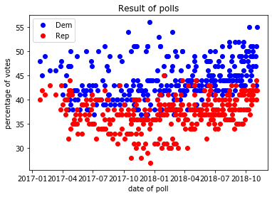
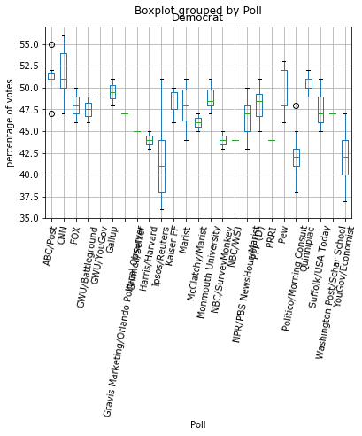
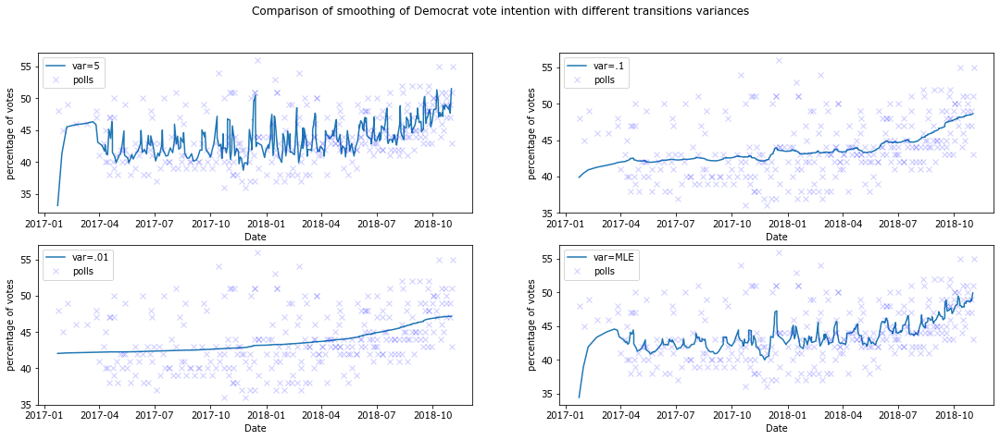
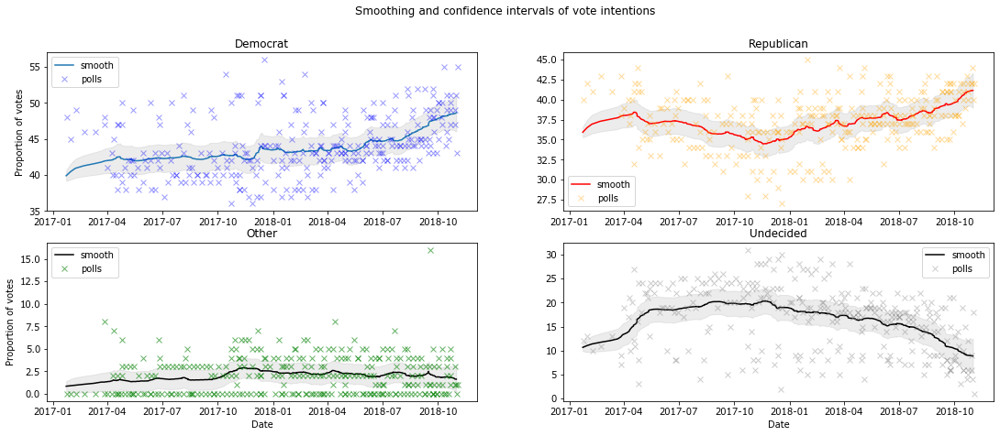
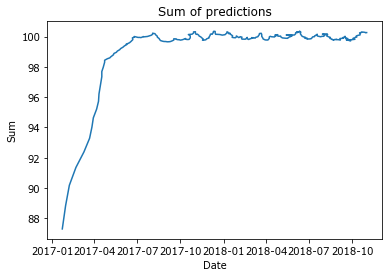
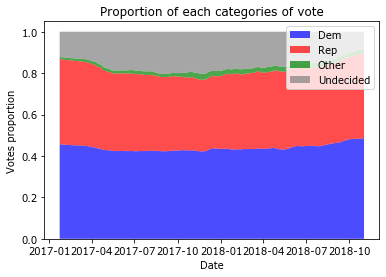
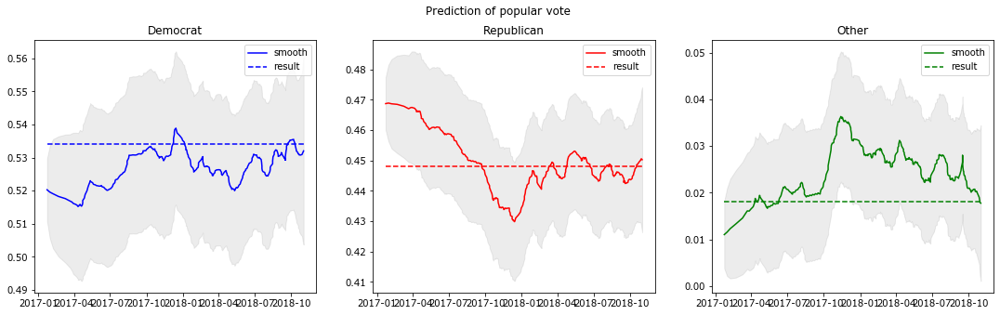
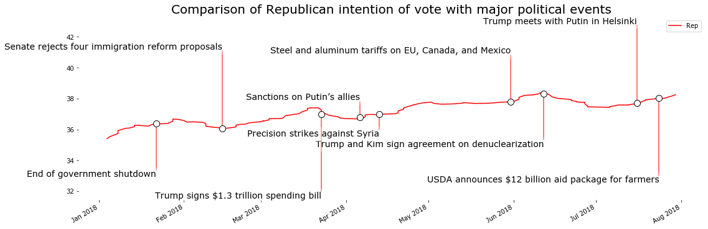

# Political volatility with polls data

We want to explain and predict election results through polls. We base this study on data scraped from an article from the Huffington Post that list polls from the 2018 midterm elections for the House of States [10](https://tguens.github.io/understand-predict-winner.github.io/references.html). All these polls are made at a national level, and can help us to predict the popular vote. The information available include the percentage of vote for the Democrats, the Republican and other parties, the percentage of undecided voters, the starting and ending date and the source. The polls where conducted from January 2017 to November 2018 (a few days before election day).

## I) Approach and modeling

The aim is to infer the intention of votes at national scale and at all times during the campaign from polling data.
    
### A) Hidden States Model
Let's model the evolution of vote intention as a linear stochastic process. The intentions of vote at a nationnal scale are unknown, we can qualify them as latent variables or hidden states. We only have access to observations on a portion of the population at different times. These observations are the polls outcomes. With these polls, we want to determine the evolution of the intentions of votes and of its uncertainty.
    
We are making the following suppositions about the polls:
    - they all are reliable.
    - targeted people are drawn at random among the whole population of people who will vote.

Let's note $$X_n = (R_n, D_n, O_n, U_n)$$ the proportion of vote intention at a national scale at time $$n$$ (respectively percentage of Republian, Democrat, other and undecided votes). Let's note $$Y_n = (r_n, d_n, o_n, u_n)$$ the observations given by the poll at time $$n$$. Let's $$p_n$$ be the number of people asked for this poll.

The sample size of a poll is very tiny compare to the number of voters that has actually voted in 2018 (1,000 compare to 100,000,000), so we can model the poll as a sample with replacement. Hence the number of voters in each class follows a binomial. For example: $$p_n r_n \sim Bin(p_n, R_n)$$, same for the 3 other classes. As $$p_n >>1$$ we can approximate the distribution by a normal, and suppose that it is continuous. The article [12](https://tguens.github.io/understand-predict-winner.github.io/references.html) proves the convergence of a binomial to a normal. This approximation will be useful to predict the hidden states by using a Kalman filter.

### B) Prediction with a Kalman filter
        
The Kalman filter is an algorithm widely used for estimating positions (e.g. GNSS applications). It gives a method to compute the hidden states, given two hypothesis:
- the process is linear
- the noises are gaussian.

I invite you to read this article if you are not familiar with this algorithm [13](https://tguens.github.io/understand-predict-winner.github.io/references.html).

We can assimilate the process as a random walk, where at each step we add some white noise to the current state (we will tackle the fact the states percentages needs to some to one a bit later in this study). Hence the process is linear. The observation is the current state plus some white noise (because we approximate the binomial by a gaussian). Hence the hypothesis to use this algorithm stands.

Given all the observations we can predict all the past hidden states, this technic is called smoothing. We are using the package pykalman [14](https://tguens.github.io/understand-predict-winner.github.io/references.html).

The algorithm works in two steps:
    - First it estimates the parameters of the linear gaussian process with the Expectation Maximisation algorithm
    - Then it computes the smoothed hidden states.
    
In order to simplify the problem, we used a different Kalman filter for each categories of vote. We lose the sum to one, but we would just have to renormalize them afterward (we will see that the sum of the smoothed proportions remain very close to one).

### II) Predicting popular vote with polls: results

#### A) Short EDA

The graph below shows the spread of polls results on percentages of Republican and Democrat votes. We can see that most polls are in favor of the Democrats, but there are lots of variety among the results. Hence, polls show very different possible outcomes. It is also difficult to tell if there is an evolution trend either.

The following boxplot shows the distribution of results given by each source of polls. On this plot, we can see that certain polls tends to give less credit to Democrat votes, but there survey may include more undecided people.

It is worth noting that a significant number of targeted people doesn't know yet for which candidate they will vote. This number of undecided voters can vary a lot among polls (~ 2% to 30%). This number is even high a few days before election day, hence a lot of uncertainty remains.

#### B) importance of imposing a transition variance
        
If we let the algorithm find by itself the transition variance (variance of the random walk) with MLE, it can be prone to overfitting the observations. We want realistic smooth curve for the national intention of vote, so we need to impose a low transition variance.

Let's have a look of the smoothing curve of Democrat votes for different values of transition variance.

Empirically, a transition variance of 0.1 seems to be a good fit. The MLE estimation is subject to overfitting, as it is too much sensitive to the noisy observations.

#### C) Smoothing and confidence intervals
        
As the distributions are gaussians, the 95% confidence interval is given by adding +- 2 standard deviations to the smoothed values.

It is very interesting to have the confidence intervals, it can give valuable insights to compare Democrats and Republicans.The undecided estimations are quite high but decreases before election day. 

Because of the lack of observations and the arbitrary choice of the first hidden state, the estimation are less precise at the beginning of 2017.

In the last part we will compare these hidden states estimation to the actual results.

#### D) Normalization of results

As we use four different filters, we lost the sum to one. So we need to normalize these estimations to compare them together. Except during the first months that are less precise (c.f. last part), we observe that the sum is very close to 100%.

#### E) Comparison with the election results of November 6 2018

This article from Wikipedia gives the result of the popular vote for the House of State elections on November 6 2018. The Democrats won with an astounding majority (nearly 8% more than the Republican, this result hasn't occured since 1990).

The problem is that even at the end of the election, a significant proportion of undecided voters subsists. We can suppose that this undecided intention of votes will follow the same distribution as the decided votes. Then we can add an undecided margin of errors to our predictions. In this study, we will neglect this source of uncertainty.

Finally by not taking into account the undecided voters, we obtain some very good predictions for 2018. We can notice that the 95% confidence intervals of Democrat and Republican don't overlap, so the victory of the Democrats was very certain.

#### F) Comparison with political events

These smoothing curves can also help to identify evolution shift, for example we can see that Republican intention of votes have been declining. Then people working in analytics can relate these shifts or evolution to real events, and understand the consequences of some events on vote intention. Therefore, this smoothing curve is valuable for people who are looking for election insights.

The article from Ballotpedia relates major events that has impacted the 2018 Congress election[16](https://tguens.github.io/understand-predict-winner.github.io/references.html).

In January 2018, we can notice that a resurgence of vote intentions for the Republican. This period corresponds to the government shutdown, it might be one of the cause of this resurgence.

Let's try to compare the evolutions of vote intentions with some political events extracted from the *Ballot Pedia* article. We restrict the comparison to the last major events that appears before the election from January 2018 to July 2018. 

Some of these events could explain some changes of vote intention, but we need to be careful that it can be just a coincidence.

### Conclusion

The obvious finding is that one could have relied on polls to predict the 2018 House election results. As we see, polls outcomes can be very different (some of these outcomes are even very unlikely, e.g. 16% of votes for other parties). We would not recommend trusting the results of a single poll. By merging all this noisy variety of observation we can reconstruct the intention of vote at a very statisfying level. Hence combining multiple polls leads to very accurate results.

We can add one other major conclusion : **Major political events and policies are highly correlated to popular opinion/popular confidence vote**.

We could extand this study in two possible ways:

- it would be interesting to stop the predictions at certain times during the year. To do so we could use the filtering part of the Kalman filter algorithm. We could also try the Kalman filter on polls of previous elections
- it would also be interesting to add granularity to this model. Indeed, we only focus on the popular vote but we could also replicate these smoothing and predictions at the district level which would enable us to make predictions in term  of number of seats.

[Next page:](https://tguens.github.io/understand-predict-winner.github.io/conclusion.html)

[Previous page:](https://tguens.github.io/understand-predict-winner.github.io/resultsa.html)

[Back to main](https://tguens.github.io/understand-predict-winner.github.io/)


